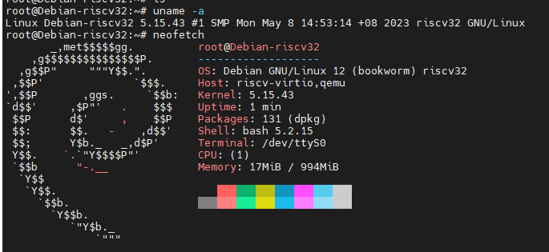

# how to use it

[wiki](https://github.com/yuzibo/riscv32/wiki)

# rebootstrap

The rebootstrap for riscv32 is [here](https://salsa.debian.org/vimerbf-guest/rebootstrap/-/tree/support_riscv32?ref_type=heads)

# display

The project is still WIP.

Co-author: Revy
